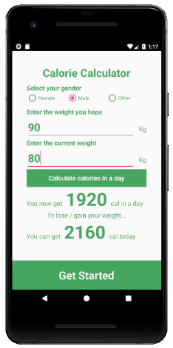
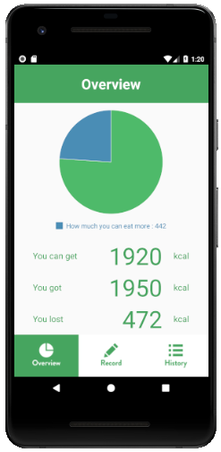
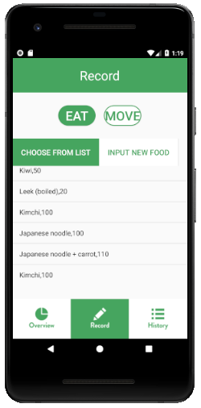
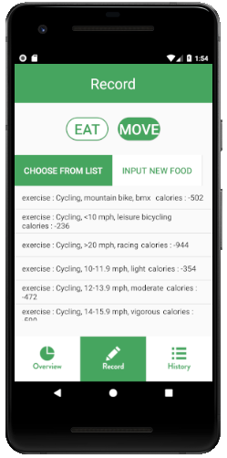
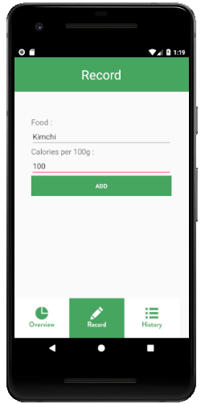
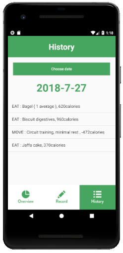
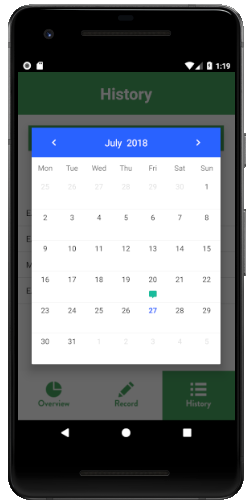

# # Calorie counter

- Daily calorie counter
- Setting target weight
- input calories that user take and consume
- monitoring the calories history

### 1. Setting target

- Set tartget weight and current weight

### 2. Overview

- shows your basic consume calories and how much you can eat today

### 3. Record 

- Choose one of  foods on the default list

- Choose one of  foods on the default list

  

- You can also add new item : INPUT NEW FOOD

  

### 4. History

- Data stored to History

### 

- You can see previous days as well

  